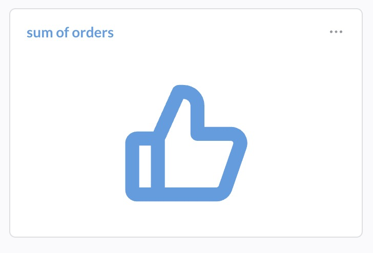

# @metabase/custom-viz-thumbs

<div>
  
  
  
</div>

A simple custom visualization for Metabase. Renders thumbs up or down depending on whether the value meets the threshold.

Requires Metabase `>= 59`.



## Data requirements

The query must return a single numerical value (1 row and 1 column).

## Settings

| Setting   | Description                                                                      |
| --------- | -------------------------------------------------------------------------------- |
| Threshold | When query result is greater or equal to this value, thumbs up will be rendered. |

## Development

```bash
npm install
npm run dev         # watch build + preview
npm run build       # compiles src/ → dist/, then packages it into a .tgz
```

`npm run build` writes `<name>-<version>.tgz` to the project root. Upload that file in **Admin → Custom visualizations → Add** to register the plugin.

> The packaged archive contains `metabase-plugin.json` plus the build output (`dist/index.js` and any whitelisted `dist/assets/*`).

## Other scripts

```bash
npm run prettier    # format
npm run type-check  # tsc --noEmit
```
